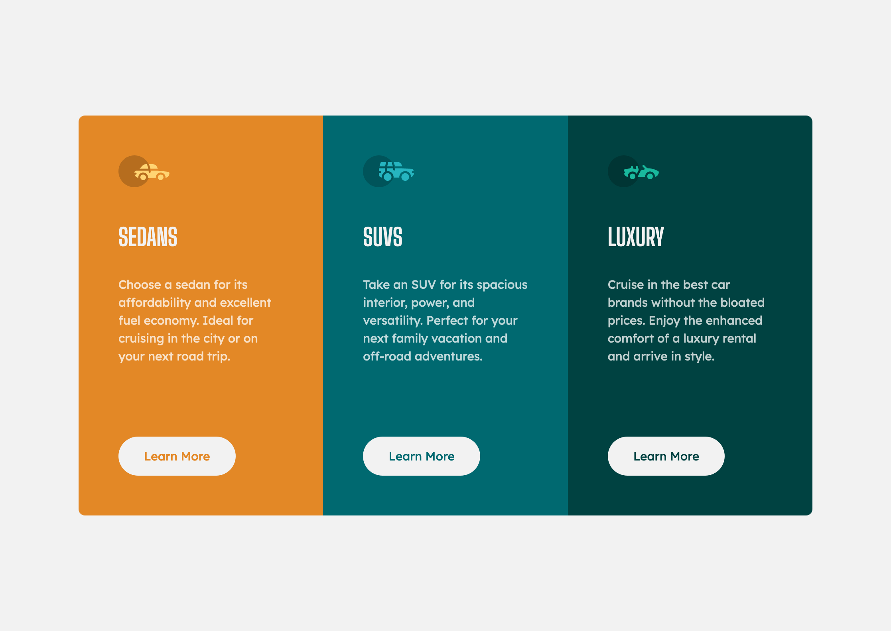

# Frontend Mentor - 3-column preview card component solution

This is a solution to the [3-column preview card component challenge on Frontend Mentor](https://www.frontendmentor.io/challenges/3column-preview-card-component-pH92eAR2-). Frontend Mentor challenges help you improve your coding skills by building realistic projects. 

## Table of contents

- [Overview](#overview)
  - [The challenge](#the-challenge)
  - [Screenshot](#screenshot)
  - [Links](#links)
- [My process](#my-process)
  - [Built with](#built-with)
  - [Continued development](#continued-development)
  - [Useful resources](#useful-resources)
- [Author](#author)

## Overview

### The challenge

Users should be able to:

- View the optimal layout depending on their device's screen size
- See hover states for interactive elements

### Screenshot

### Links

- Solution URL: [Add solution URL here](https://github.com/its-me-musa/3-column-preview-card-component-main)
- Live Site URL: [Add live site URL here](https://priceless-fermi-fa1628.netlify.app)

## My process

### Built with

- Semantic HTML5 markup
- CSS
- CSS Grid
- Flexbox
- CSS Grid
- Mobile-first workflow

### Useful resources

- [Stack overflow](https://stackoverflow.com) - This is one of the best resources out there.
- [MDN](https://developer.mozilla.org/en-US/) - This is an amazing resourcet.

## Author

- Website - [Github](https://github.com/its-me-musa)
- Frontend Mentor - [@yourusername](https://www.frontendmentor.io/profile/yourusername)
- Twitter - [@yourusername](https://www.twitter.com/yourusername)
